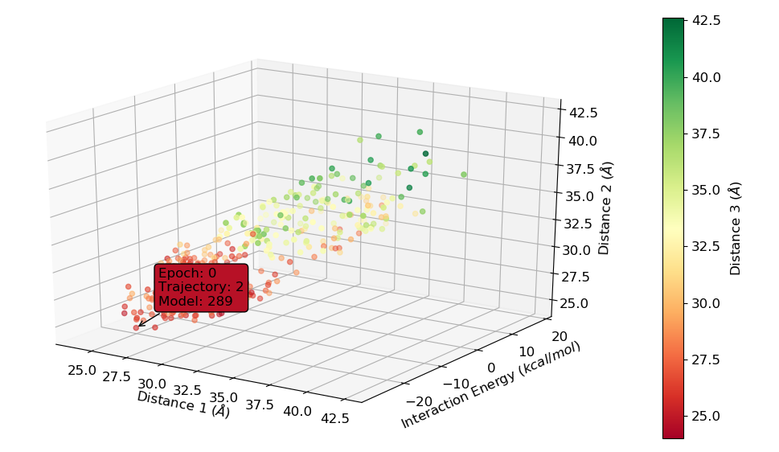

# PELEAnalysis-Processing

[](https://doge.mit-license.org/)


This repository contains Python scripts to analyze [PELE](https://pele.bsc.es/pele.wt) & [MD](https://en.wikipedia.org/wiki/Molecular_dynamics) simulations, to preprocess & process the systems ([PDB](http://www.wwpdb.org/documentation/file-format) files), tools for esterases, the mutation of PDB files using [Schrodinger](https://www.schrodinger.com/) Python API, and many more.

## Installation

A set of Python libraries are necessary to run the scripts of this Git repository. Still, they are stored in the setup.py file to setup your computer to use these tools.

## Requirements

* Python 2.7 or higher or Python 3.1 or higher must be installed (To use all the scripts in the repository, Python 3.1 or higher is recommended).

* Schrodinger Python API for Preprocessing and Protein\_Mutator scripts.

## Contents

* <b> Esterases </b>: Folder where tools concerning esterases, esters, and others can be found.

* <b> MD\_analysis </b>: Folder where the analyse\_trajectory, BoxPlot_EDesign, and ClusterizeAtoms python scripts reside (used for calculate RMSD, distances, contacts, cluster of average position of atoms, and more).

* <b> ML\_scripts </b>: Folder with scripts to perform [SVC](https://en.wikipedia.org/wiki/Support-vector_machine) on a given dataset.

* <b> PELE\_mean\_analysis </b>: Folder with R tools to analyze PELE report files.

* <b> PELE\_scripts </b>: Folder with the tools to analyze a PELE simulation and their report and trajectory files.

* <b> Preprocessing </b>: Folder with the python scripts to prepare the PDB file for the PELE simulation, to generate the force field parameters for the ligands and the unknown/unseen molecules of the PELE software. [OPLS-2005](https://en.wikipedia.org/wiki/OPLS) is the used force-field.

* <b> Protein\_Mutator </b>: Folder with python scripts to extract the binding site from a general PDB file giving some concrete residues, a scoring tool based on [RMSD](https://en.wikipedia.org/wiki/Root-mean-square_deviation_of_atomic_positions) against a reference structure, and a tool to mutate residues from a PDB file using Schrodinger Python API.

* <b> Sequence\_handler </b>: Folder where a tool to reverse-complement, trim, adaptor-removal, and alignment of DNA or protein sequences can be found.

## Examples

The vast majority of created tools contain a specific argument parser using the argparse module from Python in order to enable the usage of the scripts without looking at the code. For instance, some applications of the code will be shwon below:

<b> Sequence alignment </b>

```
python Sequence_handler.py -i P1.fasta -i2 P2.fasta -o P.aln -O alignment
```

If there are no issues in the input files, the alignment output file will be written and a exit message will be printed in the command line.

```
File 'P1.fasta' has been successfully aligned with 'P2.fasta'
```

And the alignment file will look like this:

```
0 (Identity: 54.5454545455%, Similarity: 81.8181818182%, Gaps: 9.09090909091%): 
SARLKVRKDMA
:.|||:|||  
TGRLKLRKD-E
```

<b> Plot metrics from PELE report files </b>

The i (input) flag is to state the path of the report files, and the X, Y, and Z flags are to store the metrics from the report files for the X, Y, and Z axis, respectively. The Z2 flag represents the 4th axis corresponding to the colorbar. After specifying the column where the metric resides in the report files, a title referring to each metric can be added to the plot. The TP flag is to create the ThreeDPlot, as other type of plots can be created. The CM flag can be used to change the default colormap used in the colorbar (plasma) of the plot. Finally, the S flag is used to specify the overall size of all the string elements in the plot.

```
python PELEPlot3.py -i *.out -X 7 "Distance 1" -Y 5 "Interaction Energy" -Z 6 "Distance 2"
-Z2 8 "Distance 3" -TP -CM RdYlGn -S 12
```

The output plot will be the next (also, the points can be hovered to see from which trajectories they come from and which accepted PELE steps they represent):



To get more information on how this script or other ones work, use the h flag to get the help message.

## Development

The scripts are continously modified and improved to have more functions and utilities.

